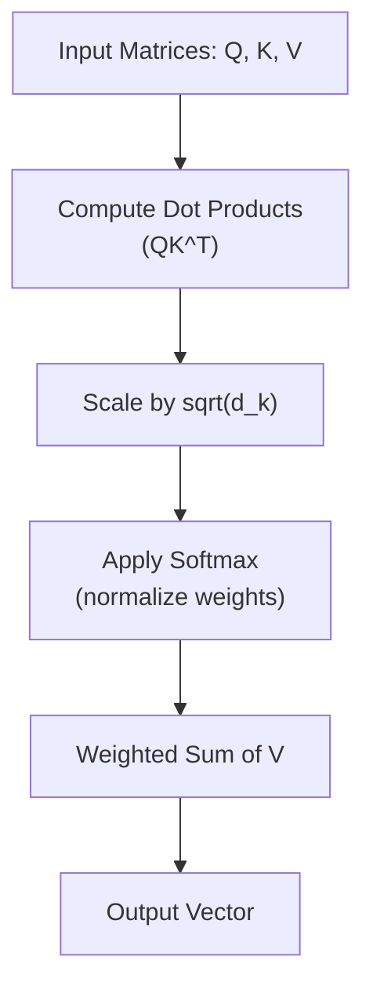

# Scaled Dot-Product Attention

*Source: 3.2.1 Scaled Dot-Product Attention of [Attention Is All You Need](https://arxiv.org/abs/1706.03762)*

## Scaled Dot-Product Attention

This concept explains how the Transformer model focuses on different parts of an input sequence to understand context. It is a specific type of **attention mechanism** (a method for weighting different parts of input data based on relevance) used to calculate relationships between positions in a sequence, such as connecting a noun to a verb.

Imagine you are searching a contact list. You type a name (**Query**), the phonebook looks up the index (**Key**), and returns the photo and number stored (**Value**). This function performs that lookup mathematically for every item in the sequence simultaneously.

## Architecture Flow

The computation happens in a specific order to ensure the weights are meaningful.

## Key Equation

$$
\mathrm{Attention}(Q,K,V) = \mathrm{softmax}\left(\frac{QK^{T}}{\sqrt{d_{k}}}\right)V
$$

(from §3.2.1)

This equation describes the full calculation. Here is the line-by-line breakdown:

1.  **$Q, K, V$**: These are the input matrices. $Q$ stands for **Queries** (what we are looking for), $K$ for **Keys** (the index or label of each item), and $V$ for **Values** (the actual content of each item). All are vectors packed into matrices.
2.  **$QK^{T}$**: We compute the dot product of the query matrix with the transpose of the key matrix. This calculates the compatibility score between every query and every key.
3.  **$\frac{QK^{T}}{\sqrt{d_{k}}}$**: We scale the dot product scores by dividing by the square root of the dimension $d_k$ (the size of the query/key vectors).
4.  **$\mathrm{softmax}(...)$**: We apply the softmax function to the scaled scores. This converts them into a probability distribution so that the weights sum to 1.
5.  **$V$**: Finally, we multiply the weights by the values matrix. This produces a weighted sum of the values, where important items contribute more to the final output vector.

## Why the Scaling Factor?

The paper introduces the scaling factor $\frac{1}{\sqrt{d_{k}}}$ to prevent the **softmax function** from entering a region where it has extremely small gradients.

If $d_k$ is large, the dot products ($QK^T$) grow large in magnitude. When the input to the softmax is too large, the function becomes "flat" (all values are close to 0 or 1). In this flat region, the derivative (gradient) is nearly zero, which stops the model from learning effectively during training. Scaling down the input keeps the values in a range where the gradients remain useful for optimization.

## Why Dot-Product?

The paper notes that this specific attention type is much faster and more space-efficient than "additive attention" (which uses a feed-forward network to compute compatibility) because it can be implemented using highly optimized **matrix multiplication** code. While additive attention performs similarly for small dimensions, dot-product attention outperforms it for large dimensions without the scaling factor.

## Citation

This concept and the scaling factor are defined in §3.2.1 of the paper.
