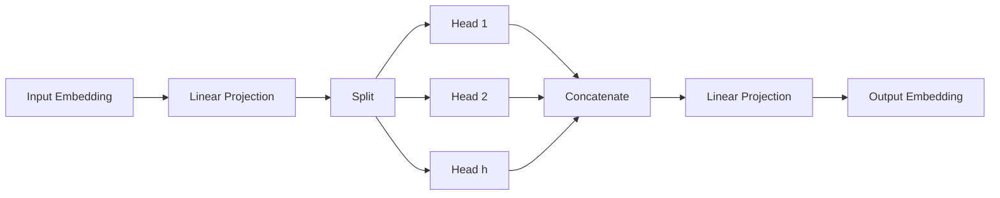

# Multi-Head Attention

*Source: 3.2.2 Multi-Head Attention of [Attention Is All You Need](https://arxiv.org/abs/1706.03762)*

## Multi-Head Attention

**What it is:** Multi-Head Attention is a specific type of attention mechanism used in the Transformer architecture. Unlike a standard attention mechanism which produces a single output vector per position, this approach allows the model to attend to information from different representation subspaces at different positions simultaneously.

**Why we use it:** In a single-head attention model, the model essentially averages information across all positions, which can dilute the signal. By splitting the attention into multiple "heads," the model can focus on different relationships in parallel. For example, one head might focus on syntactic structure (like word order), while another focuses on semantic meaning (like the topic of a sentence).

**Analogy:** Imagine you are translating a sentence from English to Spanish. A single translator might try to handle everything at once, mixing up grammar and vocabulary. Instead, you hire a team of specialists working side-by-side: one expert translates nouns, another handles verbs, and a third manages punctuation. You combine their work at the end to get the final sentence. Multi-Head Attention is like this team of specialists; each head processes the input differently, and their results are combined before the final output.

**Structure:**
The data flows through the following steps:
1.  **Linear Projection:** The input queries, keys, and values are transformed into a lower-dimensional space.
2.  **Parallel Split:** These transformed inputs are split into $h$ separate heads (in the paper, $h=8$).
3.  **Attention Calculation:** Each head runs an independent attention calculation.
4.  **Concatenation:** The outputs from all heads are joined back together.
5.  **Final Projection:** The combined output is projected to the final dimension.

**Key Equation:**
The mathematical formulation for Multi-Head Attention is defined in §3.2.2 as follows:

$$ \mathrm{MultiHead}(Q,K,V) = \mathrm{Concat}(\mathrm{head}_1, \dots, \mathrm{head}_h)W^O $$

Where each individual head is calculated as:

$$ \mathrm{head}_i = \mathrm{Attention}(QW^Q_i, KW^K_i, VW^V_i) $$

**Line-by-line Walkthrough:**

1.  **$\mathrm{MultiHead}(Q,K,V)$**: This represents the function taking three inputs: $Q$ (queries, what we are looking for), $K$ (keys, what is available), and $V$ (values, the actual data).
2.  **$W^Q_i, W^K_i, W^V_i$**: These are different learned linear projection matrices for each head $i$. They transform the original input dimensions ($d_{\text{model}}$) into smaller dimensions ($d_k$ and $d_v$).
3.  **$\mathrm{head}_i = \mathrm{Attention}(\dots)$**: This computes the attention output for a single head using the Scaled Dot-Product Attention mechanism (described in §3.2.1). It determines how much to attend to each position based on the query and key compatibility.
4.  **$\mathrm{Concat}(\mathrm{head}_1, \dots, \mathrm{head}_h)$**: The outputs from all parallel heads are stitched together into a single vector. This ensures the model can access the different perspectives computed by each head.
5.  **$W^O$**: A final linear projection combines the concatenated vector back into the original model dimension ($d_{\text{model}}$), producing the final output representation.

**Computational Efficiency:**
Despite running multiple attention heads in parallel, the total computational cost remains similar to a single-head model with full dimensionality. This is because the dimensions per head ($d_k$ and $d_v$) are reduced (e.g., $d_{\text{model}}/h$), balancing out the overhead of concatenation.

**Source:** from §3.2.2 Multi-Head Attention
