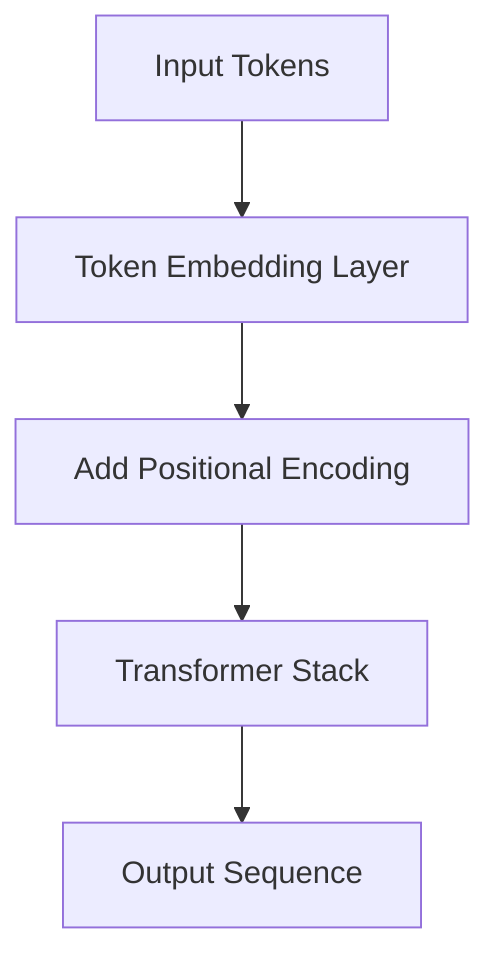

# Positional Encoding

*Source: 3.5 Positional Encoding of [Attention Is All You Need](https://arxiv.org/abs/1706.03762)*

## Positional Encoding

**The Problem: Order is lost in parallel processing**
The Transformer model processes text differently than older models like Recurrent Neural Networks (RNNs). RNNs read words one by one, so they naturally know the order of the sentence (e.g., "The cat" vs "The mat"). The Transformer, however, uses **Self-Attention**, which calculates relationships between all words in a sentence at the same time, in parallel. Because it looks at all positions simultaneously, it has no inherent way to know which word came first, second, or third. If the model sees the word "cat" and "sat" at different positions, the attention mechanism alone cannot tell them apart without extra information.

**The Solution: Adding a "Position Stamp"**
To fix this, the authors inject information about the location of each word into the input. They do this by adding a fixed vector to the word's standard embedding vector. This vector is called the **Positional Encoding**. It acts like a "position stamp" on the data, telling the model where each word sits in the sequence without forcing the model to read it step-by-step.

**The Mechanism**
The positional encoding is added to the token embeddings at the very beginning of the encoder and decoder stacks, before the data enters the attention layers.

**The Math Behind It**
The authors chose specific mathematical functions to generate these position vectors. They use sine and cosine functions at different frequencies for each dimension of the vector. This creates a unique signature for every position in the sequence.

From §3.5, the formula for the positional encoding $PE$ at position $pos$ and dimension index $i$ is defined as:

$$
\begin{aligned}
PE_{(pos, 2i)} &= \sin\left(pos / 10000^{2i/d_{\text{model}}}\right) \\
PE_{(pos, 2i+1)} &= \cos\left(pos / 10000^{2i/d_{\text{model}}}\right)
\end{aligned}
$$

**Line-by-Line Walkthrough**

1.  **$PE_{(pos, 2i)}$**: This represents the value of the positional encoding vector at a specific position (the `pos`) and the specific dimension index (the `i`). It specifically calculates the value for even-dimensional slots.
2.  **$\sin(...)$**: The function applies a sine wave.
3.  **$pos$**: This is the integer position of the word in the sequence (e.g., 1 for the first word, 2 for the second).
4.  **$10000$**: This is a fixed constant chosen to ensure the sine waves span a wide enough range of frequencies.
5.  **$2i$**: The exponent `2i` ensures that even positions get sine values and odd positions get cosine values.
6.  **$d_{\text{model}}$**: This is the size of the vector (dimensionality) used in the model (512 in this paper). It scales the frequency so that shorter dimensions change faster than longer ones.
7.  **$\cos(...)$**: For the odd-dimensional slots, a cosine wave is used instead of sine.

**Why Sine and Cosine?**
The authors chose these functions over simply learning the position vectors (like a neural network might learn them) for two main reasons:
1.  **Extrapolation**: Using fixed sine/cosine functions allows the model to potentially handle sentence lengths longer than it was trained on, whereas learned embeddings might only work for specific training lengths.
2.  **Relative Position Learning**: The specific sine/cosine frequencies allow the model to easily learn to attend to words based on their relative distance from each other (e.g., "the word 3 spots ahead"), because the encoding for position $pos+k$ can be expressed as a linear combination of the encoding for $pos$.

**Summary**
Positional encoding ensures the model understands the sequence order of the input text despite processing it entirely in parallel. It is added to the embeddings via simple vector addition and does not require the model to process information sequentially.
