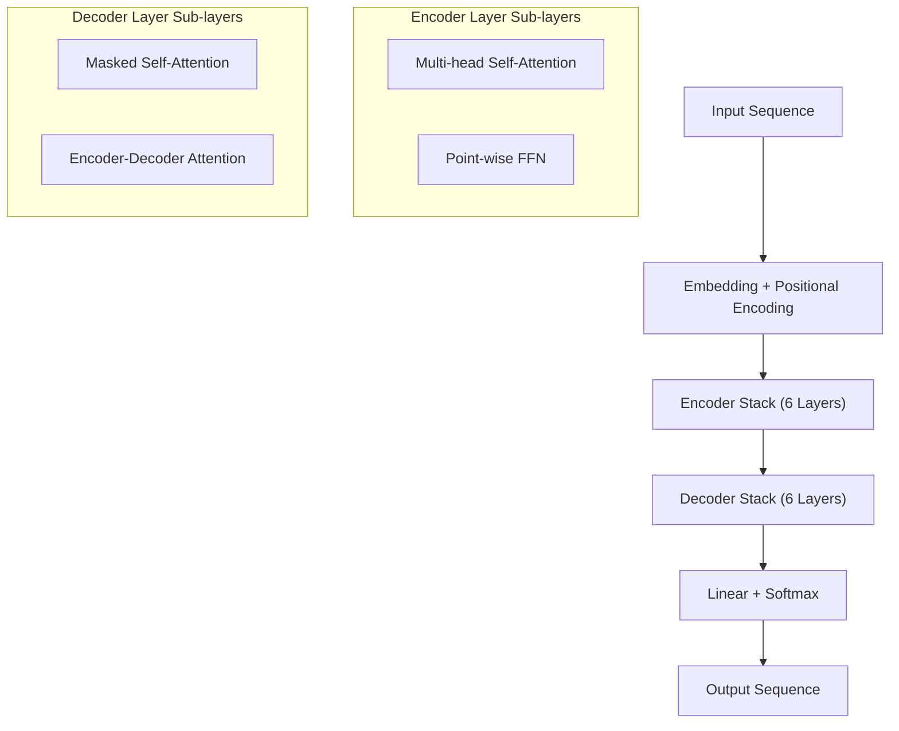

# Transformer Architecture

*Source: 3 Model Architecture of [Attention Is All You Need](https://arxiv.org/abs/1706.03762)*

**Transformer Architecture**

This architecture replaces the recurrent or convolutional layers of previous models with a mechanism called **attention** (a method to focus on relevant parts of the input data). This change makes the model faster to train and easier to parallelize, while improving translation quality [Abstract].

The overall structure is an **encoder-decoder** setup. The **encoder** processes the input sequence (e.g., English words) into a set of representations. The **decoder** then uses those representations to generate the output sequence (e.g., German words) one token at a time. This generation process is **auto-regressive**, meaning the model uses its own previous predictions to help generate the next word [Section 3].

### Core Components

The Transformer is built from stacks of identical layers. Both the encoder and decoder contain 6 such layers [Section 3.1]. Each layer consists of two main sub-layers separated by **residual connections** (a skip connection that adds the input to the output of the layer to stabilize training) and **layer normalization** (standardizing the input distribution) [Section 3].

1.  **Encoder Stacks:** Each layer contains a **multi-head self-attention mechanism** and a **point-wise feed-forward network** (a fully connected layer applied to every position).
2.  **Decoder Stacks:** Each layer contains a self-attention mechanism (masked to prevent looking at future words), an attention mechanism over the encoder's output (to look at relevant input positions), and a feed-forward network.

### Positional Encoding

Because there are no recurrence or convolution operations to determine the order of words, we must explicitly tell the model where each token sits in the sequence. We do this by adding **positional encodings** to the input embeddings before passing them to the stacks [Section 3.5]. These are sinusoidal functions of different frequencies:

$$PE_{(pos,2i)} = \sin(pos / 10000^{2i/d_{\text{model}}})$$
$$PE_{(pos,2i+1)} = \cos(pos / 10000^{2i/d_{\text{model}}})$$

Each dimension of the positional encoding corresponds to a sinusoid. This specific choice of function allows the model to learn to attend by relative positions easily; mathematically, for any fixed offset $k$, the encoding at position $pos+k$ can be represented as a linear function of the encoding at position $pos$.

### The Attention Mechanism

The core innovation is the attention function, which maps a **query** vector and a set of **key-value** pairs to an output vector. The output is a weighted sum of the values, where the weights are determined by how compatible the query is with the keys.

The specific implementation used is **Scaled Dot-Product Attention** [Section 3.2.1]. It takes query matrices $Q$, key matrices $K$, and value matrices $V$.

$$\mathrm{Attention}(Q,K,V) = \mathrm{softmax}(\frac{QK^{T}}{\sqrt{d_{k}}})V$$

**Line-by-line Walkthrough:**
1.  **$QK^{T}$**: Compute the dot products of the queries with all keys. This measures how relevant each key is to the query.
2.  **$/\sqrt{d_{k}}$**: Scale the dot products by dividing by the square root of the dimension $d_{k}$. This prevents the dot products from growing too large in magnitude, which would push the softmax function into regions with extremely small gradients.
3.  **$\mathrm{softmax}(\dots)$**: Apply a softmax function to the scaled scores to obtain a probability distribution (weights) over the values.
4.  **$V$**: Multiply the weights by the value matrix to produce a weighted sum of values, which becomes the output.

To handle different aspects of the data simultaneously, the model uses **Multi-Head Attention** [Section 3.2.2]. This runs the attention function $h$ times in parallel with different learned linear projections. The outputs are concatenated and projected once more. This allows the model to jointly attend to information from different representation subspaces at different positions.

### Feed-Forward Networks

Alongside attention, each encoder and decoder layer contains a point-wise, fully connected feed-forward network. This is applied to each position separately and identically, consisting of two linear transformations with a **ReLU** activation in between:

$$\mathrm{FFN}(x) = \max(0, xW_{1} + b_{1})W_{2} + b_{2}$$

This acts as a non-linear transformation that processes the features extracted by the attention mechanism. The linear transformations are the same across positions, but the parameters differ from layer to layer.

## Figure: Figure 1: The Transformer - model architecture.

![[fig1.png]]

Figure 1 illustrates the Transformer architecture, the core contribution of this paper. It is composed of two main stacks: an **Encoder** on the left and a **Decoder** on the right. Both stacks consist of N identical layers (marked as "Nx").

Each layer contains three main components:
1.  **Multi-Head Attention:** A mechanism that allows the model to focus on different parts of the input sequence simultaneously.
2.  **Feed Forward Networks:** Simple feed-forward networks applied independently to each position.
3.  **Add & Norm:** Residual connections with layer normalization, which stabilizes training.

Crucially, the **Encoder** processes the input sequence (Inputs), adding **Positional Encoding** to help the model understand word order. The **Decoder** (shifted right) generates the output sequence (Outputs) using **Masked Multi-Head Attention** to prevent looking ahead at future tokens during training. Finally, the output passes through a Linear layer and Softmax to generate Output Probabilities.

**Why it matters:** This architecture is significant because it is the first to rely solely on attention mechanisms, replacing the recurrent networks (RNNs) of previous models like RNNs or LSTMs. This allows for massive parallelization during training, significantly speeding up the process, while achieving superior performance in tasks like machine translation and parsing.

## Figure: Figure 2: (left) Scaled Dot-Product Attention. (right) Multi-Head Attention consists of several attention layers running in parallel.

![[fig2.png]]

Figure 2 illustrates the core computational building block of the Transformer architecture: **Scaled Dot-Product Attention**.

The diagram depicts the step-by-step calculation flow. It begins with three inputs: **Query (Q)**, **Key (K)**, and **Value (V)**. First, a matrix multiplication ($MatMul$) computes the dot products of $Q$ and $K$. This result passes through a **Scale** layer to stabilize gradients, followed by an optional **Mask** (used to prevent future information leakage during autoregressive decoding). Next, a **SoftMax** operation normalizes these scores into valid attention weights. Finally, these weights are multiplied with the $V$ input via another matrix multiplication ($MatMul$) to produce the output representation.

This figure matters because it defines the mechanism that replaces Recurrent Neural Networks (RNNs) or Convolutional Neural Networks (CNNs). By relying on this parallel attention mechanism, the Transformer can weigh the importance of any word in a sequence simultaneously, regardless of distance. This architectural choice is what allows the model to train significantly faster and achieve superior results on tasks like machine translation compared to previous state-of-the-art methods.
