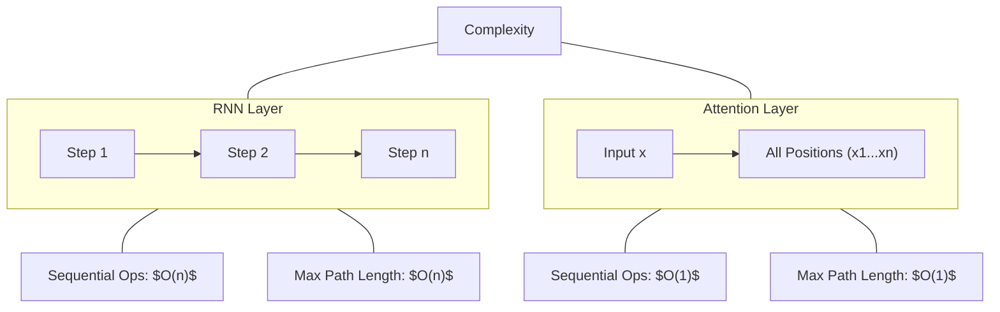

# Why Self-Attention

*Source: 4 Why Self-Attention of [Attention Is All You Need](https://arxiv.org/abs/1706.03762)*

Why Self-Attention is Used
From §4

This section explains why the authors chose **self-attention** over traditional methods like Recurrent Neural Networks (RNNs) or Convolutional Neural Networks (CNNs). In machine translation, the goal is to map an input sequence of symbols (like words, represented as $x_1, ..., x_n$) to an output sequence of the same length (represented as $z_1, ..., z_n$), where $d$ is the size of the vector representing each item.

To decide which layer type to use, the authors compared them based on three criteria:
1.  **Computational Complexity:** How much math is required per layer?
2.  **Parallelization:** How many steps must be done one after another?
3.  **Path Length:** How far does information travel to connect distant parts of the sentence?

### The Structural Difference
The core difference lies in how information moves through the network. An RNN processes data linearly, forcing it to wait for the previous step to finish. An attention layer looks at the entire sequence at once.

### Complexity Analysis
Here are the key equations comparing the cost of a single layer, where $n$ is the sequence length and $d$ is the representation dimensionality.

$$O(n^{2}\cdot d)$$

*   **Self-Attention:** The cost grows with the square of the sequence length ($n^2$) times the dimension ($d$). This is because every position in the input ($n$) must calculate a connection to every other position ($n$).
$$O(n\cdot d^{2})$$

*   **Recurrent:** The cost grows with the sequence length ($n$) times the square of the dimension ($d^2$). This happens because the network performs matrix multiplication over the hidden state dimension at every time step.

$$O(k\cdot n\cdot d^{2})$$

*   **Convolutional:** The cost is generally higher than RNNs by a factor of $k$ (kernel size). It requires a stack of layers or dilated convolutions to reach the same path length as attention, which increases complexity further.

### Why Parallelization Matters
The authors measure "minimum number of sequential operations required."
*   **Self-Attention:** $O(1)$. All positions can be processed simultaneously on parallel hardware (like GPUs).
*   **Recurrent:** $O(n)$. You cannot process step $n$ until step $n-1$ is finished. This creates a bottleneck.

Because the sequence length ($n$) for sentences is usually smaller than the representation dimensionality ($d$), the self-attention cost ($n^2 \cdot d$) is often lower than the recurrent cost ($n \cdot d^2$).

### Long-Range Dependencies
Learning long-range dependencies is difficult when information must traverse many layers. The maximum path length between any two positions in the network is:
*   **Recurrent:** $O(n)$. To connect the first word to the last word, a signal must pass through $n$ steps.
*   **Attention:** $O(1)$. Every position connects directly to every other position in a single step.

This makes it much easier for the model to learn relationships between distant words (e.g., a subject and a verb far apart in a sentence) without degrading performance.

### Restricted Attention
For very long sequences, standard self-attention might still be too slow ($O(n^2)$). The authors mention that they can restrict attention to a neighborhood of size $r$ around the current position. This changes the maximum path length to $O(n/r)$, improving efficiency for long documents, though this was planned for future work at the time of writing.
