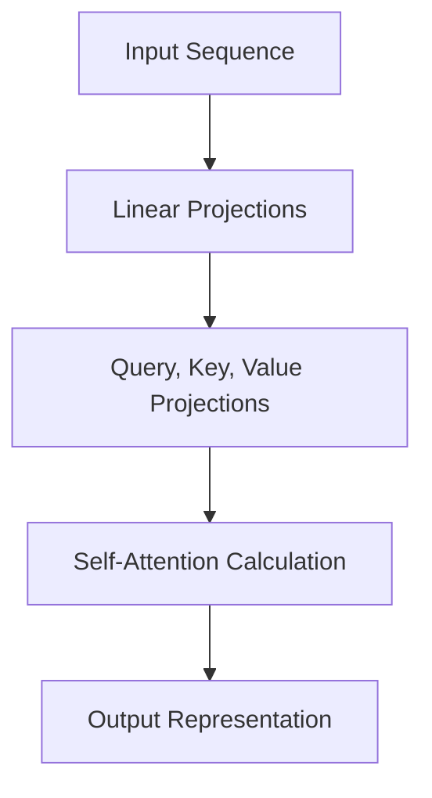

# Self-Attention

*Source: 2 Background of [Attention Is All You Need](https://arxiv.org/abs/1706.03762)*

## Self-Attention

**Source:** §2 Background of "Attention Is All You Need"

### What is it?
**Self-Attention** (sometimes called **intra-attention**) is a mechanism used in neural networks to relate different positions of a single sequence in order to compute a representation of the sequence. Unlike older methods like Recurrent Neural Networks (RNNs) or Convolutional Neural Networks (CNNs), which process data sequentially or with fixed windows, self-attention allows every word in a sentence to directly attend to every other word at the same time.

### Why do we need it?
In previous models like ConvS2S or ByteNet, the number of operations required to relate signals from two positions grew as the distance between them increased (linearly for ConvS2S, logarithmically for ByteNet). This made it hard to learn dependencies between distant words.

Self-attention reduces this cost to a **constant number of operations**, regardless of how far apart the words are. The tradeoff is that it might average information too much, which is why the authors use Multi-Head Attention to counteract this (as described in section 3.2).

**Analogy:** Imagine a group of people in a meeting room.
*   **RNN/Conv:** People pass a message around the circle one by one, or only talk to their immediate neighbors. If you want to talk to someone across the room, the message takes a long time to reach them or gets distorted.
*   **Self-Attention:** Everyone can shout their name (Key) and ask a question (Query) at the same time. Everyone hears everyone else. If you need to know what someone across the room knows, you can grab their information instantly without waiting for a chain of whispers.

### How it works (The Math)
The core calculation for attention is defined as follows:

$$
Attention(Q, K, V) = \text{softmax}\left(\frac{QK^T}{\sqrt{d_k}}\right)V
$$

Where:
*   **$Q$ (Query):** A vector representing what information the current position is looking for.
*   **$K$ (Key):** A vector representing what information a given position holds.
*   **$V$ (Value):** The actual content or representation of the position.
*   **$d_k$:** The dimension of the key vectors (the width of the attention layer).

**Line-by-line breakdown:**
1.  **$QK^T$**: We multiply the Queries by the Transpose of the Keys. This calculates a compatibility score between every pair of positions in the sequence. High scores mean "I am looking for this specific information."
2.  **$\sqrt{d_k}$**: We divide by the square root of the dimension. This is a scaling factor to keep the values from getting too large during multiplication, which helps with numerical stability (gradient flow).
3.  **$\text{softmax}$**: We normalize the scores so they sum to 1. This turns the raw scores into probabilities (weights) indicating how much of the other positions we should trust.
4.  **$V$**: Finally, we take the weighted sum of the Values. This gives us a new representation that combines information from all positions, weighted by how relevant they are.

### Data Flow
The following diagram shows how data flows through the attention mechanism layer described in the background:

### Summary
This mechanism is the foundation of the Transformer architecture. It allows the model to be fully parallelizable (faster training) and handles long-range dependencies better than sequential networks, despite the tradeoff of slightly reduced effective resolution due to the averaging effect.
